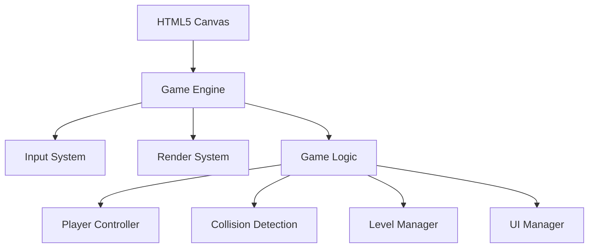

## 1. Architecture Design


## 2. Technology Description
- **Frontend**: 原生 HTML5 + JavaScript + Canvas 2D
- **无需后端**: 纯前端游戏
- **开发工具**: 直接使用浏览器运行
- **架构模式**: MVC 轻量级模式

## 3. File Structure
| 文件 | 用途 |
|------|------|
| index.html | 游戏主页面，包含 Canvas 和 UI |
| game.js | 核心游戏引擎类 |
| player.js | 玩家/机甲类定义 |
| bullet.js | 子弹/攻击特效类 |
| input.js | 输入处理系统 |
| ui.js | UI 渲染和管理 |
| level.js | 关卡和场景管理 |

## 4. Core Classes

### 4.1 Game 类
```javascript
class Game {
  constructor(canvas)
  init()
  start()
  update()
  render()
  gameLoop()
}
```

### 4.2 Player 类
```javascript
class Player {
  constructor(x, y, color, controls)
  move(dx, dy)
  meleeAttack()
  rangedAttack()
  defend()
  takeDamage(amount)
  update()
  render(ctx)
}
```

### 4.3 Bullet 类
```javascript
class Bullet {
  constructor(x, y, direction, owner)
  update()
  render(ctx)
  checkCollision(target)
}
```

## 5. Controls
| 操作 | 玩家1 | 玩家2 |
|------|-------|-------|
| 上 | W | ↑ |
| 下 | S | ↓ |
| 左 | A | ← |
| 右 | D | → |
| 近攻 | J | 1 |
| 远攻 | K | 2 |
| 防御 | L | 3 |

## 6. Game Rules
- 初始血量: 100
- 近程攻击伤害: 15
- 远程攻击伤害: 10
- 防御减伤: 80%
- 攻击冷却: 0.5秒
- 关卡递进: 每局胜利后难度提升（攻击伤害+5%）
