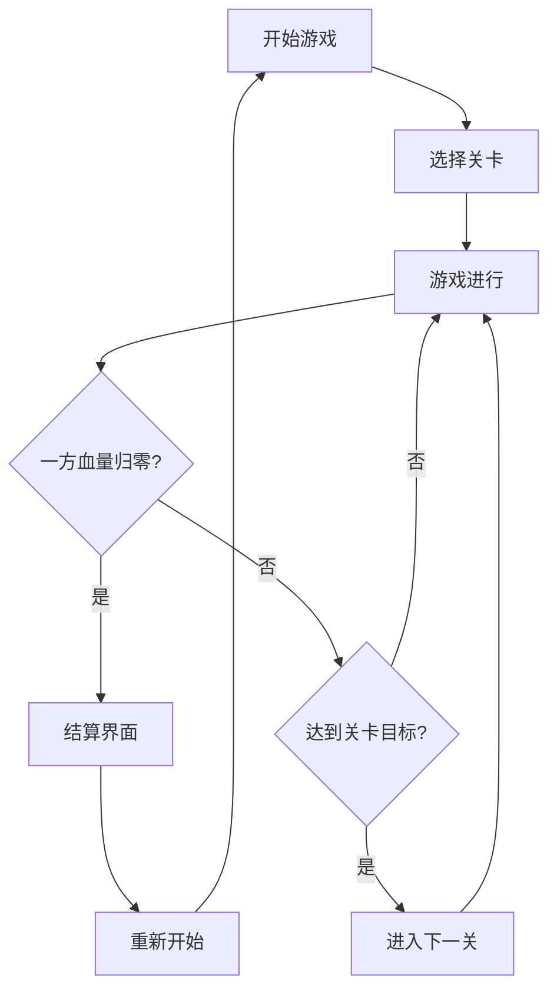

## 1. Product Overview
双人像素风机甲对战小游戏，支持本地双人对战，包含移动、攻击、防御等多种操作，具有血量系统和关卡机制。

## 2. Core Features

### 2.1 User Roles
| Role | Description |
|------|-------------|
| 玩家1 | 使用 W/A/S/D 移动，J/K 攻击，L 防御 |
| 玩家2 | 使用方向键移动，1/2 攻击，3 防御 |

### 2.2 Feature Module
1. **游戏主界面**: 标题、开始按钮、操作说明
2. **游戏界面**: 双机甲方对战、血量条、关卡显示、控制提示
3. **结算界面**: 显示胜利方、重新开始按钮

### 2.3 Page Details
| Page Name | Module Name | Feature description |
|-----------|-------------|---------------------|
| 游戏主界面 | 标题区域 | 像素风格游戏标题，动态闪烁效果 |
| 游戏主界面 | 操作说明 | 两玩家控制按键说明 |
| 游戏界面 | 游戏场景 | 像素风格战场背景，包含障碍物 |
| 游戏界面 | 机甲角色 | 两个可控制的像素机甲，支持动画 |
| 游戏界面 | 战斗系统 | 近程攻击、远程攻击、防御机制 |
| 游戏界面 | UI 显示 | 双方血量条、当前关卡、得分显示 |
| 结算界面 | 结果展示 | 显示胜利方，动画效果 |

## 3. Core Process

### 游戏流程

## 4. User Interface Design

### 4.1 Design Style
- **设计风格**: 复古像素风 (8-bit/16-bit)
- **主色调**: 深蓝色 (#1a1a2e)、科技蓝 (#0f3460)、红色 (#e94560)、绿色 (#00ff88)
- **按钮风格**: 像素化矩形，带阴影和按下效果
- **字体**: 等宽像素字体
- **布局风格**: 居中对称，复古街机感
- **视觉元素**: 扫描线、噪点、CRT 效果

### 4.2 Page Design Overview
| Page Name | Module Name | UI Elements |
|-----------|-------------|-------------|
| 主界面 | 标题区域 | 大号像素字体，渐变色彩，闪烁动画 |
| 游戏界面 | 游戏画布 | 800x600 像素画布，深色背景，网格线条 |
| 游戏界面 | 机甲角色 | 16x24 像素块组成的机甲，区分红蓝两色，包含行走、攻击、防御动画 |
| 游戏界面 | 血量条 | 像素化条形，红色减少动画 |
| 游戏界面 | 特效 | 攻击光效、爆炸特效、护盾效果 |

### 4.3 Responsiveness
- 桌面端优先设计，固定分辨率 800x600
- 支持浏览器窗口缩放保持像素风格

### 4.4 像素风格设计细节
- 角色: 16x24 像素尺寸，8-bit 色彩
- 子弹: 8x8 像素
- 背景: 网格+障碍物，工业废墟风格
